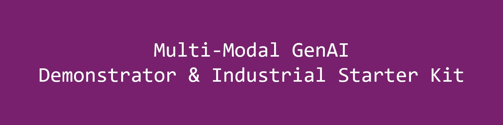
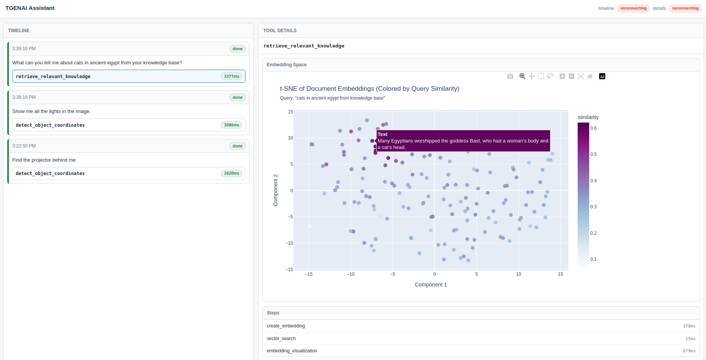

# Multi-Modal GenAI Demonstrator and Industrial Starter Kit

<p align="left">
    
    
    
    
</p>

<p align="center">
    
</p>

This repository contains materials for **WP3: Robust GenAI for multi-modal data** from the TrustGenAI FAIR Special Project.

## Overview

The WP3 demonstrator provides a modular agent runtime that combines:

- **LLM orchestration** through Agno AgentOS.
- **Vision tools** through MCP services (camera + VLM reasoning).
- **Knowledge retrieval** over an embedded LanceDB vector store.
- **Explainability** through a real-time browser timeline/tool-detail GUI.

The current scope is intentionally limited to WP3 and does not include WP1, WP2, or WP4 implementation details.

<p align="center">
    
    <br>
    <em>TGENAI interface</em>
</p>

## Architecture

The Docker setup starts one shared image and multiple services:

| Service | Default Port | Purpose |
|---|---:|---|
| `agent` | `3000` | Main TGENAI assistant runtime API |
| `camera-mcp-service` | `5001` | Camera capture MCP server |
| `vlm-mcp-service` | `5002` | VLM reasoning MCP server |
| `knowledge-mcp-service` | `5003` | Knowledge retrieval MCP server |
| `tgui-broker` | `3001` | Real-time GUI timeline and tool-detail broker |
| `redis` | `6379` | Event backbone and runtime messaging |

> [!NOTE]
> The agent can also reference an external robot MCP endpoint through `MCP_SERVER_ROBOT_URL`.

## Prerequisites

- Docker Engine with Docker Compose
- API credentials for:
    - Google API (`GOOGLE_API_KEY`) for Gemini Robotics ER usage
    - Azure OpenAI (`AZURE_OPENAI_API_KEY`, `AZURE_OPENAI_ENDPOINT`) for agent/model and embedding flows

> [!NOTE]
> The current demonstrator is designed for Linux hosts with a connected camera. If you are using Windows or MacOS, you may need to run the camera MCP service on a separate Linux host and point the agent to that endpoint or directly run the camera MCP service on the host device.

## Configuration

1. Create your environment file from the template:

```bash
cp .env.template .env
```

2. Update the required keys in `.env`:

```env
GOOGLE_API_KEY=...
AZURE_OPENAI_API_KEY=...
AZURE_OPENAI_ENDPOINT=https://<your-resource-name>.openai.azure.com/openai/v1
```

3. Optionally adjust service ports and MCP URLs if your environment requires custom networking.

## Quick Start (Docker)

Start all services:

```bash
docker compose up --build
```

> [!NOTE]
> The first time you run `docker compose up --build`, it is normal for the cli to show some errors, this is because it tries to find the docker images on the docker registry. After the first run, it should have built all the required images, and work without errors. Alternatively, you can run `docker compose build` to build of all required images.

Open the interfaces:

- Agno chat UI: https://os.agno.com/ (from there, connect to `http://localhost:3000` for local agent)
- Local activity monitor: http://localhost:3001/gui/

Health-check endpoints:

- Agent: `http://localhost:3000/health`
- TGUI broker: `http://localhost:3001/health`

Stop all services:

```bash
docker compose down
```

## Data Persistence

Runtime state is stored under `runtime_data/` (mounted into containers), including:

- Session databases (`fair_agent.db`, `fair_server.db`)
- Knowledge vector store (`knowledge.lancedb`)

Redis is ephemeral by default in the current compose setup. If you need Redis persistence across restarts, add a dedicated Redis volume in `compose.yaml`.

## Local Development (Without Docker)

Set up Python:

```bash
python3 -m venv .venv
source .venv/bin/activate
pip install --upgrade pip
pip install -e .
```

Run services in separate terminals:

```bash
# Terminal 1
python -m tgenai_agent.tools.camera_tool_mcp_server

# Terminal 2
python -m tgenai_agent.tools.vlm_tool_mcp_server

# Terminal 3
python -m tgenai_agent.tools.knowledge_tool_mcp_server

# Terminal 4
python -m tgenai_agent.tgui_broker.server

# Terminal 5
python -m tgenai_agent.fair_server
```

## Knowledge Indexing

You can index line-based knowledge facts into LanceDB using:

```bash
python scripts/index_knowledge.py data/<your_facts_file>.txt
```

Each non-empty line is treated as one knowledge item. Use `--source`, `--db`, or `--table` for custom indexing targets.

## Project Structure

```text
tgenai_agent/
    agent.py                    # Agent initialization and tool registration
    fair_server.py              # Main runtime FastAPI server
    config.py                   # Environment-driven configuration
    eventing/                   # Redis event schema/publisher/hooks
    gui_backend/                # Agent->GUI event bridge backend pieces
    knowledge/                  # Embeddings, LanceDB store, retrieval/indexing
    tgui_broker/                # GUI websocket/event broker server
    tools/                      # MCP servers (camera, VLM, knowledge)
    vlm/                        # VLM integration and annotation utilities
gui/                          # Static web GUI assets
scripts/index_knowledge.py    # Knowledge indexing helper script
runtime_data/                 # Persistent runtime output/state
```

## Examples

Some example prompts to try in the Agno chat UI:
- "Find the object named Bob based on the information in the knowledge base, and tell me where it is located."
- "Search the knowledge base for information about cats in ancient Egypt and summarize the results."
    FOLLOW-UP: "Verify online if this information is accurate and provide a summary of your findings."

If running on Linux with a connected camera, you can also try:
- "Show me the camera feed and describe what you see."
- "Analyze the latest camera feed and provide a summary of detected objects."
- "What items can you find on my desk based on the camera feed and knowledge base?"


## Troubleshooting

- **Service cannot start**: verify `.env` keys and confirm required ports are free.
- **Camera tool returns no frame**: check camera permissions/device access and container privileges.
- **No tool events in GUI**: ensure `redis` and `tgui-broker` are healthy, then check `/health` endpoints.
- **Knowledge search returns empty results**: confirm the knowledge store has been indexed and the configured embedding credentials are valid.


## Data and Sharing Principles

See [data/readme.md](data/readme.md) for data directory conventions.

## Contributing

For now, this repository is primarily maintained within the TrustGenAI WP3 context. If you plan to contribute, open an issue first to align on scope and priorities.

## Accreditation
This directory (WP3) is developed and maintained by Flanders Make.